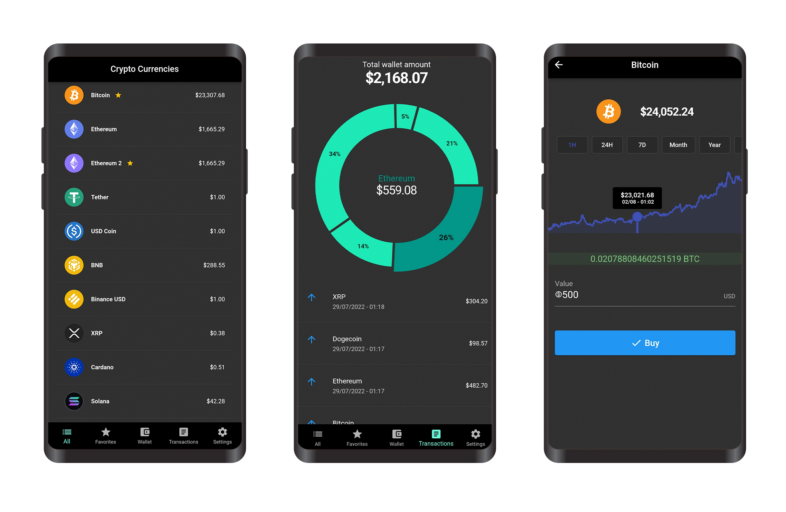
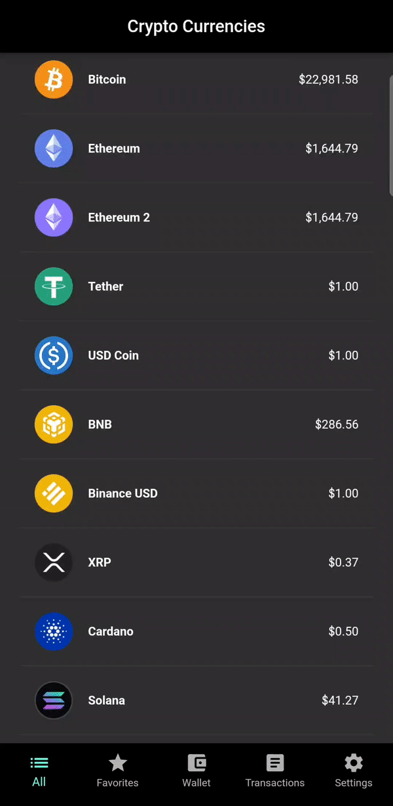
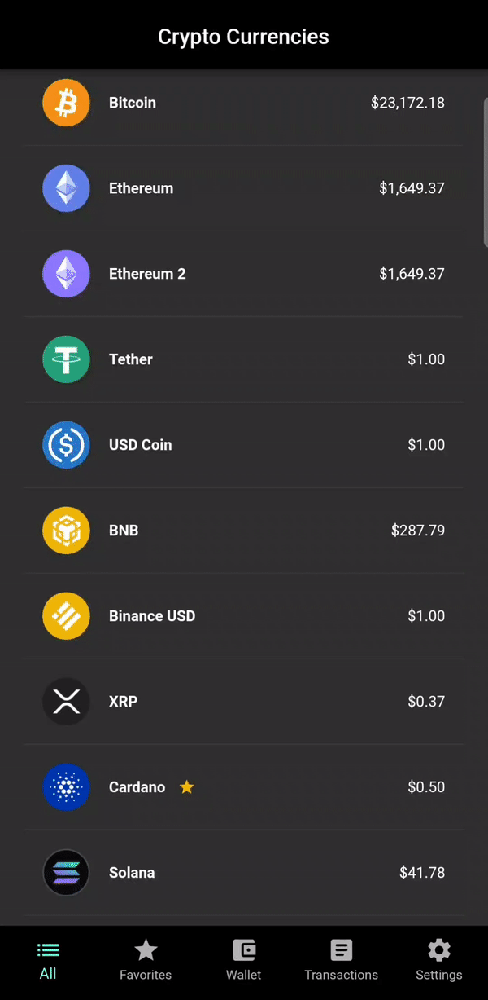
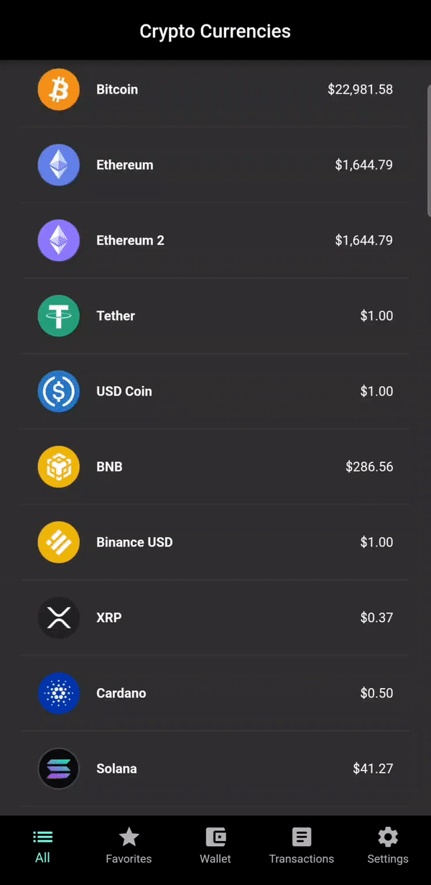

&nbsp;&nbsp;
&nbsp;&nbsp;
&nbsp;&nbsp;

# crypto simulator

## Crypto simulator is a trading simulator that allows buying and selling cryptocurrencies and simulate the profit earned. The app has interactive charts and trading history.

## Features
* Login / Sign Up / Google Login
* List currencies from coinbase API / refresh price
* price change chart from 1H | 24H | 7D | MONTH | YEAR | ALL
* Buy / Sell currency
* Favorite currencies
* View Wallet
* View wallet chart
* View Transactions / Trading history
* View Profile / Edit Profile
* Set Balance
* Logout

## Dependencies

     
 Click to expand 

* [http](https://pub.dev/packages/http)
* [sqflite](https://pub.dev/packages/sqflite)
* [go_router](https://pub.dev/packages/go_router)
* [image_picker](https://pub.dev/packages/image_picker)
* [fl_chart](https://pub.dev/packages/fl_chart)
* [intl](https://pub.dev/packages/intl)
* [provider](https://pub.dev/packages/provider)
* [firebase_core](https://pub.dev/packages/firebase_core)
* [cloud_firestore](https://pub.dev/packages/cloud_firestore)
* [firebase_auth](https://pub.dev/packages/firebase_auth)
* [firebase_storage](https://pub.dev/packages/firebase_storage)
* [google_sign_in](https://pub.dev/packages/google_sign_in)

## App Demo
 

     login, sign-up, google-login | add-fav-cryptos, user-profile, set-balance, edit-user, logout
  

  

 
 &nbsp &nbsp &nbsp

 

     refresh-price, buy-crypto, sell-crypto | change-time-chart, wallet-chart
  

  

 
 &nbsp &nbsp &nbsp

